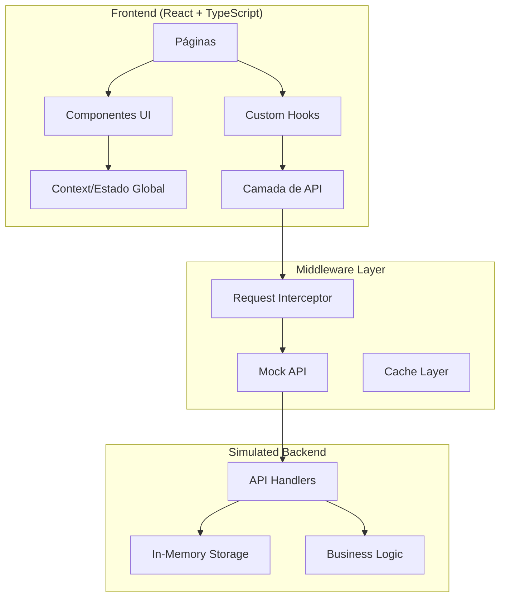
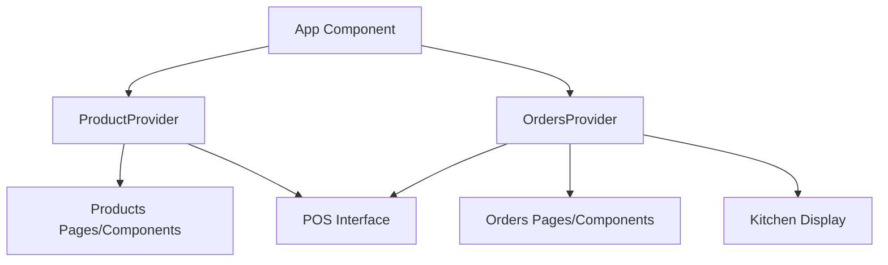
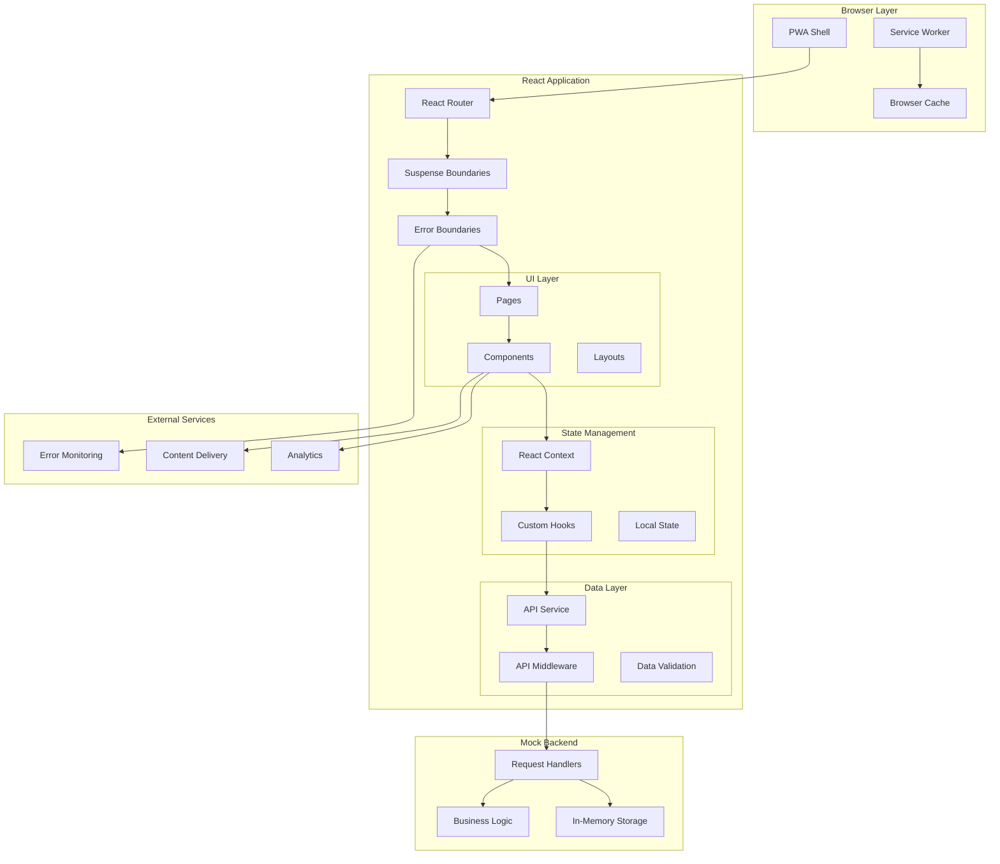

# Arquitetura do Sistema - POS/Restaurant Management

## Visão Geral da Arquitetura

O Sistema POS/Restaurant Management é construído com uma arquitetura moderna, escalável e modular, seguindo as melhores práticas de desenvolvimento frontend e preparado para integração com backend.



---

## Arquitetura de Frontend

### Component-Based Architecture

```
src/
├── components/
│   ├── ui/                 # Componentes base (Shadcn/UI)
│   │   ├── button.tsx
│   │   ├── dialog.tsx
│   │   └── ...
│   ├── layout/             # Componentes de layout
│   │   ├── DashboardLayout.tsx
│   │   └── AppSidebar.tsx
│   ├── forms/              # Formulários especializados
│   │   ├── ProductForm.tsx
│   │   └── NewOrderForm.tsx
│   ├── pos/                # Componentes do POS
│   │   ├── POSInterface.tsx
│   │   ├── ProductList.tsx
│   │   └── OrderSummary.tsx
│   └── inventory/          # Gestão de estoque
│       └── InventoryManagement.tsx
├── pages/                  # Páginas da aplicação
├── context/                # Estado global
├── hooks/                  # Custom hooks
├── api/                    # Camada de API
└── lib/                    # Utilitários
```

### Padrão de Composição

```typescript
// Exemplo de composição de componentes
const DashboardLayout = ({ children }: { children: ReactNode }) => (
  <div className="min-h-screen flex w-full">
    <AppSidebar />
    <main className="flex-1">
      <Header />
      <div className="p-6">
        {children}
      </div>
    </main>
  </div>
);

// Uso
const Dashboard = () => (
  <DashboardLayout>
    <DashboardContent />
  </DashboardLayout>
);
```

---

## Gerenciamento de Estado

### Context + Hooks Pattern

```typescript
// ProductContext.tsx
interface ProductContextType {
  products: Product[];
  addProduct: (product: Omit<Product, 'id'>) => void;
  updateProduct: (product: Product) => void;
  deleteProduct: (id: number) => void;
}

const ProductContext = createContext<ProductContextType>();

export const ProductProvider = ({ children }: { children: ReactNode }) => {
  const [products, setProducts] = useState<Product[]>([]);
  
  const addProduct = (product: Omit<Product, 'id'>) => {
    const newProduct = { ...product, id: Date.now() };
    setProducts(prev => [...prev, newProduct]);
  };
  
  return (
    <ProductContext.Provider value={{ products, addProduct }}>
      {children}
    </ProductContext.Provider>
  );
};

// Custom Hook
export const useProducts = () => {
  const context = useContext(ProductContext);
  if (!context) {
    throw new Error('useProducts must be used within ProductProvider');
  }
  return context;
};
```

### Estado Distribuído



---

## Camada de API

### API Middleware Pattern

```typescript
// apiMiddleware.tsx
export const ApiMiddlewareProvider = ({ children }: { children: ReactNode }) => {
  useEffect(() => {
    const originalFetch = window.fetch;
    
    window.fetch = async function(input: RequestInfo | URL, init?: RequestInit) {
      const url = typeof input === 'string' ? input : input.toString();
      
      // Interceptar apenas requests para nossa API
      if (!url.startsWith('/api/')) {
        return originalFetch(input, init);
      }
      
      // Processar request mockado
      return await processMockRequest(url, init);
    };
    
    return () => { window.fetch = originalFetch; };
  }, []);
  
  return <>{children}</>;
};
```

### Service Layer

```typescript
// apiService.ts
export const ProductsAPI = {
  getAll: async (): Promise<Product[]> => {
    const response = await fetch('/api/products');
    return handleResponse(response);
  },
  
  create: async (product: Omit<Product, 'id'>): Promise<Product> => {
    const response = await fetch('/api/products', {
      method: 'POST',
      headers: { 'Content-Type': 'application/json' },
      body: JSON.stringify(product)
    });
    return handleResponse(response);
  }
};

const handleResponse = async (response: Response) => {
  if (!response.ok) {
    throw new Error(`API Error: ${response.statusText}`);
  }
  return response.json();
};
```

---

## Roteamento e Navegação

### React Router Structure

```typescript
// App.tsx
const App = () => (
  <BrowserRouter>
    <Routes>
      <Route path="/" element={<LandingPage />} />
      <Route path="/dashboard" element={<Dashboard />} />
      <Route path="/products" element={<Products />} />
      <Route path="/orders" element={<Orders />} />
      <Route path="/kds" element={<KitchenDisplay />} />
      <Route path="/cashier" element={<Cashier />} />
      <Route path="/reports" element={<Reports />} />
      <Route path="*" element={<NotFound />} />
    </Routes>
  </BrowserRouter>
);
```

### Route Guards (Preparado para Autenticação)

```typescript
// ProtectedRoute.tsx
const ProtectedRoute = ({ children, requiredRole }: ProtectedRouteProps) => {
  const { user, isLoading } = useAuth();
  
  if (isLoading) return <LoadingSpinner />;
  
  if (!user) return <Navigate to="/login" replace />;
  
  if (requiredRole && !user.roles.includes(requiredRole)) {
    return <Navigate to="/unauthorized" replace />;
  }
  
  return <>{children}</>;
};
```

---

## Padrões de Design

### Compound Components

```typescript
// Exemplo: Sidebar com composição
const Sidebar = ({ children }: { children: ReactNode }) => (
  <aside className="w-64 bg-gray-800 text-white">
    {children}
  </aside>
);

const SidebarHeader = ({ children }: { children: ReactNode }) => (
  <div className="p-4 border-b">
    {children}
  </div>
);

const SidebarContent = ({ children }: { children: ReactNode }) => (
  <div className="flex-1 p-4">
    {children}
  </div>
);

// Uso
<Sidebar>
  <SidebarHeader>
    <Logo />
  </SidebarHeader>
  <SidebarContent>
    <Navigation />
  </SidebarContent>
</Sidebar>
```

### Render Props

```typescript
// DataFetcher component
interface DataFetcherProps<T> {
  url: string;
  children: (data: T | null, loading: boolean, error: Error | null) => ReactNode;
}

const DataFetcher = <T,>({ url, children }: DataFetcherProps<T>) => {
  const [data, setData] = useState<T | null>(null);
  const [loading, setLoading] = useState(true);
  const [error, setError] = useState<Error | null>(null);
  
  useEffect(() => {
    fetch(url)
      .then(response => response.json())
      .then(setData)
      .catch(setError)
      .finally(() => setLoading(false));
  }, [url]);
  
  return <>{children(data, loading, error)}</>;
};

// Uso
<DataFetcher<Product[]> url="/api/products">
  {(products, loading, error) => {
    if (loading) return <Spinner />;
    if (error) return <ErrorMessage error={error} />;
    return <ProductList products={products} />;
  }}
</DataFetcher>
```

### Custom Hooks

```typescript
// useLocalStorage hook
export const useLocalStorage = <T>(key: string, initialValue: T) => {
  const [storedValue, setStoredValue] = useState<T>(() => {
    try {
      const item = window.localStorage.getItem(key);
      return item ? JSON.parse(item) : initialValue;
    } catch (error) {
      console.error(`Error reading localStorage key "${key}":`, error);
      return initialValue;
    }
  });

  const setValue = (value: T | ((val: T) => T)) => {
    try {
      const valueToStore = value instanceof Function ? value(storedValue) : value;
      setStoredValue(valueToStore);
      window.localStorage.setItem(key, JSON.stringify(valueToStore));
    } catch (error) {
      console.error(`Error setting localStorage key "${key}":`, error);
    }
  };

  return [storedValue, setValue] as const;
};

// useDebounce hook
export const useDebounce = <T>(value: T, delay: number): T => {
  const [debouncedValue, setDebouncedValue] = useState<T>(value);

  useEffect(() => {
    const handler = setTimeout(() => {
      setDebouncedValue(value);
    }, delay);

    return () => {
      clearTimeout(handler);
    };
  }, [value, delay]);

  return debouncedValue;
};
```

---

## Performance Optimization

### Code Splitting

```typescript
// Lazy loading de páginas
const Dashboard = lazy(() => import('./pages/Dashboard'));
const Products = lazy(() => import('./pages/Products'));
const Orders = lazy(() => import('./pages/Orders'));

// Componente com Suspense
const App = () => (
  <Suspense fallback={<LoadingSpinner />}>
    <Routes>
      <Route path="/dashboard" element={<Dashboard />} />
      <Route path="/products" element={<Products />} />
      <Route path="/orders" element={<Orders />} />
    </Routes>
  </Suspense>
);
```

### Memoization

```typescript
// React.memo para componentes
const ProductCard = React.memo(({ product }: { product: Product }) => (
  <div className="product-card">
    <h3>{product.name}</h3>
    <p>R$ {product.price.toFixed(2)}</p>
  </div>
));

// useMemo para cálculos pesados
const ExpensiveComponent = ({ items }: { items: OrderItem[] }) => {
  const total = useMemo(() => 
    items.reduce((sum, item) => sum + item.price * item.quantity, 0),
    [items]
  );

  const sortedItems = useMemo(() => 
    [...items].sort((a, b) => a.name.localeCompare(b.name)),
    [items]
  );

  return (
    <div>
      <p>Total: R$ {total.toFixed(2)}</p>
      {sortedItems.map(item => (
        <ItemCard key={item.id} item={item} />
      ))}
    </div>
  );
};

// useCallback para funções
const ProductList = ({ products }: { products: Product[] }) => {
  const handleProductClick = useCallback((productId: number) => {
    // Handle click
  }, []);

  return (
    <div>
      {products.map(product => (
        <ProductCard 
          key={product.id} 
          product={product}
          onClick={() => handleProductClick(product.id)}
        />
      ))}
    </div>
  );
};
```

### Virtual Scrolling

```typescript
// Para listas grandes
import { FixedSizeList as List } from 'react-window';

const VirtualizedProductList = ({ products }: { products: Product[] }) => {
  const Row = ({ index, style }: { index: number; style: React.CSSProperties }) => (
    <div style={style}>
      <ProductCard product={products[index]} />
    </div>
  );

  return (
    <List
      height={600}
      itemCount={products.length}
      itemSize={120}
      width="100%"
    >
      {Row}
    </List>
  );
};
```

---

## Error Handling

### Error Boundaries

```typescript
class ErrorBoundary extends React.Component<
  { children: ReactNode; fallback?: ReactNode },
  { hasError: boolean; error?: Error }
> {
  constructor(props: any) {
    super(props);
    this.state = { hasError: false };
  }

  static getDerivedStateFromError(error: Error) {
    return { hasError: true, error };
  }

  componentDidCatch(error: Error, errorInfo: React.ErrorInfo) {
    console.error('Error caught by boundary:', error, errorInfo);
    // Enviar para serviço de logging (ex: Sentry)
  }

  render() {
    if (this.state.hasError) {
      return this.props.fallback || (
        <div className="error-fallback">
          <h2>Algo deu errado!</h2>
          <p>Por favor, recarregue a página.</p>
        </div>
      );
    }

    return this.props.children;
  }
}

// Hook para reset de erro
export const useErrorHandler = () => {
  return (error: Error, errorInfo?: React.ErrorInfo) => {
    console.error('Error handled:', error, errorInfo);
    // Logging, analytics, etc.
  };
};
```

### Async Error Handling

```typescript
// Hook para operações assíncronas
export const useAsyncOperation = <T>() => {
  const [data, setData] = useState<T | null>(null);
  const [loading, setLoading] = useState(false);
  const [error, setError] = useState<Error | null>(null);

  const execute = useCallback(async (operation: () => Promise<T>) => {
    try {
      setLoading(true);
      setError(null);
      const result = await operation();
      setData(result);
      return result;
    } catch (err) {
      const error = err instanceof Error ? err : new Error('Unknown error');
      setError(error);
      throw error;
    } finally {
      setLoading(false);
    }
  }, []);

  return { data, loading, error, execute };
};

// Uso
const ProductManager = () => {
  const { data, loading, error, execute } = useAsyncOperation<Product>();

  const handleCreateProduct = async (productData: Omit<Product, 'id'>) => {
    try {
      await execute(() => ProductsAPI.create(productData));
      toast.success('Produto criado com sucesso!');
    } catch (error) {
      toast.error('Erro ao criar produto');
    }
  };

  return (
    <div>
      {loading && <Spinner />}
      {error && <ErrorMessage error={error} />}
      {/* Form components */}
    </div>
  );
};
```

---

## Testing Architecture

### Estrutura de Testes

```
src/
├── components/
│   ├── ProductCard.tsx
│   └── __tests__/
│       ├── ProductCard.test.tsx
│       └── ProductCard.integration.test.tsx
├── hooks/
│   ├── useProducts.ts
│   └── __tests__/
│       └── useProducts.test.ts
├── utils/
│   ├── formatters.ts
│   └── __tests__/
│       └── formatters.test.ts
└── __tests__/
    ├── setup.ts
    └── mocks/
        ├── handlers.ts
        └── server.ts
```

### Test Utilities

```typescript
// test-utils.tsx
import { render, RenderOptions } from '@testing-library/react';
import { ReactElement } from 'react';
import { BrowserRouter } from 'react-router-dom';
import { ProductProvider } from '../context/ProductContext';

const AllTheProviders = ({ children }: { children: React.ReactNode }) => {
  return (
    <BrowserRouter>
      <ProductProvider>
        {children}
      </ProductProvider>
    </BrowserRouter>
  );
};

const customRender = (
  ui: ReactElement,
  options?: Omit<RenderOptions, 'wrapper'>
) => render(ui, { wrapper: AllTheProviders, ...options });

export * from '@testing-library/react';
export { customRender as render };
```

---

## Security Architecture

### Input Validation

```typescript
// Esquemas de validação com Zod
import { z } from 'zod';

export const ProductSchema = z.object({
  name: z.string().min(1, 'Nome é obrigatório').max(100),
  price: z.number().positive('Preço deve ser positivo'),
  category: z.string().min(1, 'Categoria é obrigatória'),
  description: z.string().optional(),
  stock: z.number().min(0, 'Estoque não pode ser negativo'),
});

// Hook para validação
export const useValidation = <T>(schema: z.ZodSchema<T>) => {
  const validate = (data: unknown): { success: boolean; data?: T; errors?: string[] } => {
    try {
      const result = schema.parse(data);
      return { success: true, data: result };
    } catch (error) {
      if (error instanceof z.ZodError) {
        return { 
          success: false, 
          errors: error.errors.map(e => e.message) 
        };
      }
      return { success: false, errors: ['Validation error'] };
    }
  };

  return { validate };
};
```

### Content Security Policy

```typescript
// Security headers para produção
const securityHeaders = {
  'X-Frame-Options': 'SAMEORIGIN',
  'X-XSS-Protection': '1; mode=block',
  'X-Content-Type-Options': 'nosniff',
  'Referrer-Policy': 'strict-origin-when-cross-origin',
  'Content-Security-Policy': [
    "default-src 'self'",
    "script-src 'self' 'unsafe-inline'",
    "style-src 'self' 'unsafe-inline'",
    "img-src 'self' data: https:",
    "font-src 'self' https:",
    "connect-src 'self' https://api.restaurante.com"
  ].join('; ')
};
```

---

## Mobile Architecture

### Responsive Design System

```typescript
// Breakpoints system
const breakpoints = {
  sm: '640px',
  md: '768px',
  lg: '1024px',
  xl: '1280px',
  '2xl': '1536px'
};

// Hook para detecção de dispositivo
export const useDevice = () => {
  const [isMobile, setIsMobile] = useState(false);
  const [isTablet, setIsTablet] = useState(false);

  useEffect(() => {
    const checkDevice = () => {
      const width = window.innerWidth;
      setIsMobile(width < 768);
      setIsTablet(width >= 768 && width < 1024);
    };

    checkDevice();
    window.addEventListener('resize', checkDevice);
    return () => window.removeEventListener('resize', checkDevice);
  }, []);

  return { isMobile, isTablet, isDesktop: !isMobile && !isTablet };
};
```

### Touch Interactions

```typescript
// Hook para gestos touch
export const useTouch = () => {
  const [startPos, setStartPos] = useState<{ x: number; y: number } | null>(null);

  const handleTouchStart = (e: TouchEvent) => {
    const touch = e.touches[0];
    setStartPos({ x: touch.clientX, y: touch.clientY });
  };

  const handleTouchEnd = (e: TouchEvent, onSwipe?: (direction: string) => void) => {
    if (!startPos) return;

    const touch = e.changedTouches[0];
    const deltaX = touch.clientX - startPos.x;
    const deltaY = touch.clientY - startPos.y;

    const minSwipeDistance = 50;

    if (Math.abs(deltaX) > Math.abs(deltaY)) {
      if (Math.abs(deltaX) > minSwipeDistance) {
        onSwipe?.(deltaX > 0 ? 'right' : 'left');
      }
    } else {
      if (Math.abs(deltaY) > minSwipeDistance) {
        onSwipe?.(deltaY > 0 ? 'down' : 'up');
      }
    }

    setStartPos(null);
  };

  return { handleTouchStart, handleTouchEnd };
};
```

---

## Diagrama de Arquitetura Completa



Esta arquitetura garante:

- **Escalabilidade**: Modular e extensível
- **Manutenibilidade**: Código limpo e bem organizado
- **Performance**: Otimizações em vários níveis
- **Segurança**: Validação e proteções adequadas
- **Testabilidade**: Estrutura que facilita testes
- **Acessibilidade**: Componentes inclusivos
- **Responsividade**: Funciona em todos os dispositivos

---

*Documentação de Arquitetura atualizada em: $(date)*
*Versão do sistema: 1.0.0*
