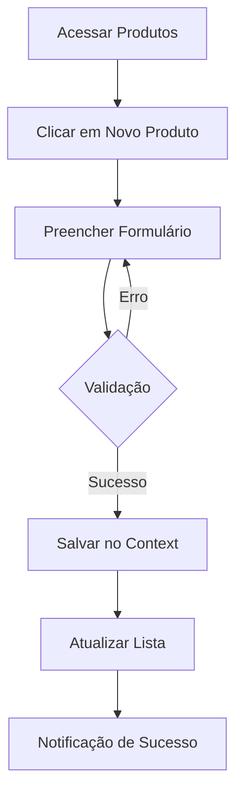
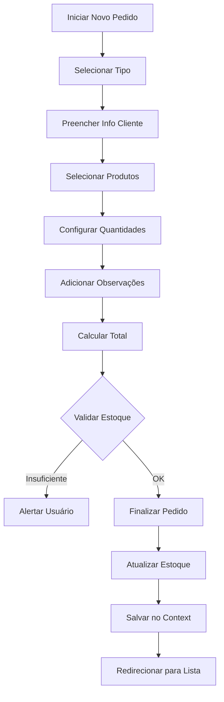
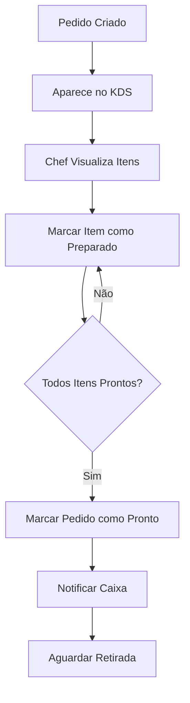
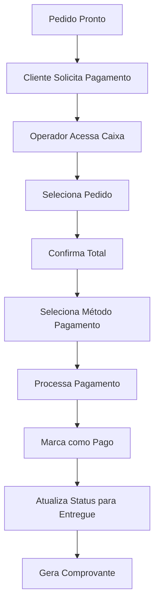
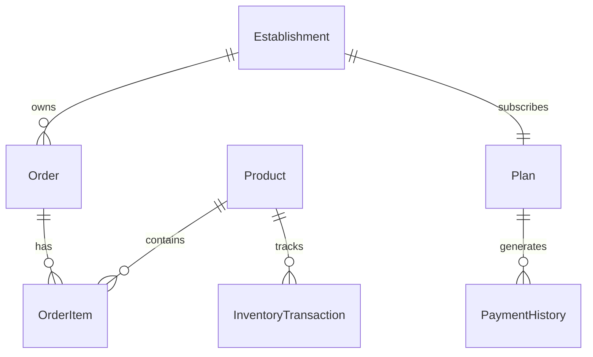

# Sistema POS/Restaurant Management - Documentação Completa

## Índice
1. [Visão Geral](#visão-geral)
2. [Tecnologias Utilizadas](#tecnologias-utilizadas)
3. [Arquitetura do Sistema](#arquitetura-do-sistema)
4. [Funcionalidades](#funcionalidades)
5. [Fluxos de Trabalho](#fluxos-de-trabalho)
6. [API e Integração](#api-e-integração)
7. [Estrutura de Dados](#estrutura-de-dados)
8. [Autenticação e Autorização](#autenticação-e-autorização)
9. [Planos e Pagamentos](#planos-e-pagamentos)
10. [Deploy e Configuração](#deploy-e-configuração)

---

## Visão Geral

O Sistema POS/Restaurant Management é uma solução completa para gerenciamento de restaurantes, oferecendo funcionalidades de ponto de venda (POS), gestão de estoque, controle de pedidos, sistema de cozinha (KDS) e relatórios analíticos.

### Principais Características:
- **Multi-tenant SaaS**: Suporte a múltiplos estabelecimentos
- **Sistema de Planos**: Diferentes níveis de funcionalidades
- **Interface Responsiva**: Funciona em desktop, tablet e mobile
- **Tempo Real**: Atualizações instantâneas entre módulos
- **Sistema Offline-First**: Funciona mesmo sem conexão

---

## Tecnologias Utilizadas

### Frontend
- **React 18.3.1** - Biblioteca principal para UI
- **TypeScript** - Tipagem estática
- **Vite** - Build tool e dev server
- **React Router DOM 6.26.2** - Roteamento
- **Tailwind CSS** - Framework CSS utilitário
- **Shadcn/UI** - Biblioteca de componentes
- **Lucide React** - Ícones
- **React Query (TanStack Query)** - Gerenciamento de estado servidor
- **React Hook Form** - Formulários
- **Recharts** - Gráficos e visualizações
- **Sonner** - Notificações toast

### Backend/API
- **API Middleware personalizada** - Simulação de backend
- **Context API** - Gerenciamento de estado global
- **LocalStorage** - Persistência local de dados

### Ferramentas de Desenvolvimento
- **ESLint** - Linting
- **PostCSS** - Processamento CSS
- **Bun** - Package manager

---

## Arquitetura do Sistema

### Estrutura de Pastas
```
src/
├── api/                    # Camada de API e middleware
├── components/             # Componentes reutilizáveis
│   ├── ui/                # Componentes base (Shadcn)
│   ├── layout/            # Componentes de layout
│   ├── forms/             # Formulários
│   ├── pos/               # Componentes do POS
│   └── inventory/         # Componentes de estoque
├── context/               # Contextos React (estado global)
├── hooks/                 # Custom hooks
├── pages/                 # Páginas da aplicação
├── types/                 # Definições de tipos TypeScript
└── lib/                   # Utilitários e configurações
```

### Padrões Arquiteturais
- **Component-Based Architecture**: Componentes modulares e reutilizáveis
- **Context + Hooks Pattern**: Gerenciamento de estado centralizado
- **API-First Design**: Separação clara entre frontend e lógica de dados
- **Responsive Design**: Mobile-first approach

---

## Funcionalidades

### 1. Dashboard Administrativo
- **Visão geral**: Métricas principais em tempo real
- **Vendas do dia**: Gráficos de vendas por período
- **Produtos em baixa**: Alertas de estoque
- **Pedidos recentes**: Lista dos últimos pedidos
- **Atividade diária**: Análise de picos de movimento

### 2. Gestão de Produtos
- **Cadastro de produtos**: Nome, categoria, preço, descrição, imagem
- **Controle de estoque**: Quantidade, alertas de baixa
- **Categorias**: Organização por tipos (Lanches, Pizzas, Bebidas, etc.)
- **Status**: Ativo/Inativo para disponibilidade
- **Histórico de movimentação**: Entradas e saídas de estoque

### 3. Sistema POS (Point of Sale)
- **Interface intuitiva**: Seleção rápida de produtos
- **Múltiplos tipos de pedido**:
  - Mesa (número da mesa)
  - Retirada (nome e telefone)
  - Delivery (endereço completo + taxa)
- **Customização de itens**: Observações por produto
- **Cálculo automático**: Subtotal, taxas, total
- **Validação de estoque**: Verificação em tempo real

### 4. Gestão de Pedidos
- **Visualização completa**: Lista todos os pedidos por status
- **Filtros avançados**: Por data, status, tipo, cliente
- **Edição de pedidos**: Adicionar/remover itens, alterar observações
- **Controle de status**: Aguardando → Em preparo → Pronto → Entregue
- **Gestão de pagamentos**: Controle de valores e métodos

### 5. Sistema de Cozinha (KDS)
- **Interface dedicada**: Focada na produção
- **Pedidos em tempo real**: Atualizações automáticas
- **Controle por item**: Marcar itens como preparados
- **Priorização**: Sistema de urgência e tempo decorrido
- **Feedback visual**: Cores e alertas por tempo de espera

### 6. Caixa e Pagamentos
- **Processamento de pagamentos**: Dinheiro, cartão, PIX
- **Controle de caixa**: Abertura, fechamento, sangria
- **Histórico de transações**: Todas as movimentações
- **Relatórios de fechamento**: Resumo diário de vendas

### 7. Relatórios e Analytics
- **Vendas por período**: Dia, semana, mês
- **Produtos mais vendidos**: Ranking e quantidade
- **Receita por categoria**: Análise de performance
- **Atividade por horário**: Picos de movimento
- **Relatórios exportáveis**: PDF, Excel

### 8. Configurações
- **Perfil do estabelecimento**: Dados, logo, configurações
- **Usuários**: Gestão de funcionários e permissões
- **Impostos e taxas**: Configuração regional
- **Impressoras**: Integração com equipamentos
- **Backup/Restore**: Segurança dos dados

---

## Fluxos de Trabalho

### Fluxo de Cadastro de Produtos



**Passo a passo detalhado:**
1. **Acesso**: Usuário navega para `/products`
2. **Iniciação**: Clica no botão "Novo Produto"
3. **Formulário**: Preenche campos obrigatórios:
   - Nome (string, obrigatório)
   - Categoria (select, obrigatório)
   - Preço (number, > 0)
   - Descrição (string, opcional)
   - Estoque inicial (number, >= 0)
   - Status (Ativo/Inativo)
4. **Validação**: Sistema verifica dados
5. **Persistência**: Dados salvos no ProductContext
6. **Feedback**: Notificação toast de sucesso

### Fluxo de Criação de Pedidos



**Detalhamento técnico:**

1. **Iniciação do Pedido**:
   ```typescript
   // Componente: POSInterface
   const [orderType, setOrderType] = useState<"mesa" | "retirada" | "delivery">();
   ```

2. **Coleta de Dados do Cliente**:
   - **Mesa**: Apenas número da mesa
   - **Retirada**: Nome + telefone
   - **Delivery**: Nome + telefone + endereço + referência + taxa

3. **Seleção de Produtos**:
   ```typescript
   const handleAddItem = (product: Product, quantity: number, notes: string) => {
     // Verificação de estoque
     const availableStock = getStockForProduct(product.id);
     if (quantity > availableStock) {
       toast.error("Estoque insuficiente");
       return;
     }
     
     // Criação do item do pedido
     const newItem: OrderItem = {
       id: Date.now(),
       productId: product.id,
       name: product.name,
       price: product.price,
       quantity,
       notes,
       prepared: false
     };
     
     setOrderItems([...orderItems, newItem]);
   };
   ```

4. **Finalização**:
   ```typescript
   const handleSubmitOrder = () => {
     // Validações
     validateOrderData();
     
     // Atualizar estoque
     updateInventoryOnSale(orderItems);
     
     // Criar pedido
     const orderData = formatOrderData();
     addOrder(orderData);
   };
   ```

### Fluxo de Processamento na Cozinha



**Implementação técnica:**

1. **Filtro de Pedidos KDS**:
   ```typescript
   const kitchenOrders = orders.filter(
     order => ["Aguardando", "Em preparo"].includes(order.status)
   );
   ```

2. **Toggle de Item Preparado**:
   ```typescript
   const toggleItemPrepared = (orderId: string, itemIndex: number) => {
     setOrders(orders.map(order => {
       if (order.id === orderId) {
         const updatedItems = [...order.items];
         updatedItems[itemIndex].prepared = !updatedItems[itemIndex].prepared;
         return { ...order, items: updatedItems };
       }
       return order;
     }));
   };
   ```

### Fluxo de Caixa e Pagamento



---

## API e Integração

### Estrutura da API

O sistema utiliza um middleware personalizado que simula uma API REST completa:

#### Endpoints Principais

```typescript
// Produtos
GET    /api/products              // Listar todos
GET    /api/products/:id          // Buscar por ID
POST   /api/products              // Criar novo
PUT    /api/products/:id          // Atualizar
DELETE /api/products/:id          // Excluir
GET    /api/products/low-stock    // Produtos em baixa

// Pedidos
GET    /api/orders                // Listar todos
GET    /api/orders/:id            // Buscar por ID
POST   /api/orders                // Criar novo
PATCH  /api/orders/:id/status     // Atualizar status
GET    /api/orders/kitchen        // Pedidos para cozinha
PATCH  /api/orders/:id/items/:index/toggle-prepared  // Toggle item

// Estoque
GET    /api/inventory             // Transações de estoque
POST   /api/inventory/transaction // Nova transação
GET    /api/inventory/product/:id // Por produto

// Relatórios
GET    /api/reports/sales/:period        // Vendas por período
GET    /api/reports/revenue/:period      // Receita por período
GET    /api/reports/top-products/:period // Produtos top
GET    /api/reports/order-stats/:period  // Estatísticas
GET    /api/reports/daily-activity       // Atividade diária

// Estabelecimentos (SaaS)
GET    /api/establishments         // Listar estabelecimentos
POST   /api/establishments         // Criar estabelecimento
GET    /api/establishments/:id     // Buscar por ID
PUT    /api/establishments/:id     // Atualizar
PATCH  /api/establishments/:id/toggle-status  // Ativar/Desativar

// Planos
GET    /api/plans                  // Listar planos
GET    /api/plans/:id              // Buscar plano por ID
```

### Middleware de API

```typescript
// src/api/apiMiddleware.tsx
export const ApiMiddlewareProvider = ({ children }) => {
  useEffect(() => {
    const originalFetch = window.fetch;
    
    window.fetch = async function(input, init) {
      const url = typeof input === 'string' ? input : input.toString();
      
      // Interceptar apenas requisições para nossa API
      if (!url.startsWith('/api/')) {
        return originalFetch(input, init);
      }
      
      // Simular delay de rede
      await new Promise(resolve => setTimeout(resolve, 100));
      
      // Processar requisição e retornar resposta mockada
      return processApiRequest(url, init);
    };
    
    return () => { window.fetch = originalFetch; };
  }, []);
};
```

### Handlers de API

```typescript
// src/api/apiHandlers.ts
export const ProductsHandler = {
  getAll: () => [...products],
  
  create: (product: Omit<Product, "id">) => {
    const newId = Math.max(...products.map(p => p.id)) + 1;
    const newProduct = { ...product, id: newId };
    products.push(newProduct);
    return newProduct;
  },
  
  update: (updatedProduct: Product) => {
    const index = products.findIndex(p => p.id === updatedProduct.id);
    if (index === -1) throw new Error(`Product ${updatedProduct.id} not found`);
    products[index] = updatedProduct;
    return updatedProduct;
  }
};
```

---

## Estrutura de Dados

### Entidades Principais

#### Product (Produto)
```typescript
interface Product {
  id: number;                    // Identificador único
  name: string;                  // Nome do produto
  category: string;              // Categoria (Lanches, Pizzas, etc.)
  price: number;                 // Preço unitário
  status: "Ativo" | "Inativo";   // Status de disponibilidade
  image?: string;                // URL da imagem
  description?: string;          // Descrição detalhada
  stock: number;                 // Quantidade em estoque
}
```

#### Order (Pedido)
```typescript
interface Order {
  id: string;                    // ID único (#001, #002, etc.)
  customer: string;              // Informações do cliente
  items: OrderItem[];            // Itens do pedido
  status: "Aguardando" | "Em preparo" | "Pronto" | "Entregue";
  time: string;                  // Horário do pedido
  elapsedTime: string;           // Tempo decorrido
  priority: "Normal" | "Urgente"; // Prioridade
  total: number;                 // Valor total
  paid?: boolean;                // Status de pagamento
  paymentMethod?: "Dinheiro" | "Cartão" | "PIX" | null;
}
```

#### OrderItem (Item do Pedido)
```typescript
interface OrderItem {
  id: number;                    // ID único do item
  name: string;                  // Nome do produto
  quantity: number;              // Quantidade solicitada
  notes: string;                 // Observações especiais
  price?: number;                // Preço unitário
  prepared: boolean;             // Status de preparo
  productId?: number;            // Referência ao produto
}
```

#### InventoryTransaction (Transação de Estoque)
```typescript
interface InventoryTransaction {
  id: number;                    // ID da transação
  productId: number;             // ID do produto
  type: "entrada" | "saida";     // Tipo de movimentação
  quantity: number;              // Quantidade movimentada
  reason: string;                // Motivo da movimentação
  date: string;                  // Data da transação
  userId?: string;               // Usuário responsável
}
```

### Relacionamentos



---

## Autenticação e Autorização

### Níveis de Acesso

1. **Super Admin**:
   - Gerenciar todos os estabelecimentos
   - Configurar planos e preços
   - Acessar dados analíticos globais

2. **Admin do Estabelecimento**:
   - Gerenciar produtos e categorias
   - Configurar funcionários
   - Acessar relatórios completos

3. **Gerente**:
   - Gerenciar pedidos e estoque
   - Acessar relatórios básicos
   - Configurar promoções

4. **Operador de Caixa**:
   - Criar e finalizar pedidos
   - Processar pagamentos
   - Consultar produtos

5. **Cozinha**:
   - Visualizar pedidos em preparo
   - Marcar itens como prontos
   - Solicitar mais tempo

### Implementação (Preparada para Supabase)

```typescript
// Estrutura preparada para integração com Supabase Auth
interface User {
  id: string;
  email: string;
  role: 'super_admin' | 'admin' | 'manager' | 'cashier' | 'kitchen';
  establishment_id?: string;
  permissions: string[];
}

// Context de autenticação
const AuthContext = createContext<{
  user: User | null;
  login: (email: string, password: string) => Promise<void>;
  logout: () => void;
  hasPermission: (permission: string) => boolean;
}>({});
```

---

## Planos e Pagamentos (SaaS)

### Estrutura de Planos

```typescript
interface Plan {
  id: number;
  name: string;                  // Básico, Profissional, Enterprise
  price: number;                 // Valor mensal
  period: string;                // "mês"
  features: string[];            // Lista de funcionalidades
  popular?: boolean;             // Destaque no marketing
  maxProducts?: number;          // Limite de produtos
  maxTerminals?: number;         // Limite de terminais POS
}
```

### Planos Disponíveis

#### 1. Plano Básico (R$ 49,90/mês)
- Até 100 produtos
- 1 terminal PDV
- Relatórios básicos
- Suporte por email
- Funcionalidades essenciais

#### 2. Plano Profissional (R$ 99,90/mês) ⭐ Popular
- Produtos ilimitados
- 3 terminais PDV
- KDS completo
- Relatórios avançados
- Suporte prioritário
- Integração com delivery

#### 3. Plano Enterprise (R$ 199,90/mês)
- Tudo do Profissional
- Terminais ilimitados
- Multi-estabelecimentos
- API personalizada
- Suporte 24/7
- Consultoria gratuita

### Gestão de Estabelecimentos

```typescript
interface Establishment {
  id: string;                    // est-001, est-002, etc.
  name: string;                  // Nome do estabelecimento
  currentPlanId: number;         // Plano atual
  status: "active" | "inactive"; // Status da conta
  createdAt: string;             // Data de criação
  settings: {
    theme: string;
    timezone: string;
    currency: string;
    tax_rate: number;
  };
}
```

### Histórico de Pagamentos

```typescript
interface PaymentHistory {
  id: number;
  establishmentId: string;
  planId: number;
  planName: string;
  amount: number;
  status: "Pago" | "Processando" | "Falhou";
  paymentMethod: "Cartão de crédito" | "PIX" | "Boleto";
  date: string;
  invoiceUrl: string;
  period: string;                // "15/01/2024 - 14/02/2024"
}
```

---

## Deploy e Configuração

### Variáveis de Ambiente

```bash
# Configurações da aplicação
VITE_APP_TITLE="Sistema POS"
VITE_APP_VERSION="1.0.0"

# URLs da API (produção)
VITE_API_BASE_URL="https://api.restaurante.com"

# Configurações de integração
VITE_STRIPE_PUBLIC_KEY="pk_live_..."
VITE_SUPABASE_URL="https://projeto.supabase.co"
VITE_SUPABASE_ANON_KEY="eyJ..."

# Configurações de analytics
VITE_GA_TRACKING_ID="G-XXXXXXXXXX"
```

### Scripts de Build

```json
{
  "scripts": {
    "dev": "vite",
    "build": "tsc && vite build",
    "preview": "vite preview",
    "lint": "eslint . --ext ts,tsx --report-unused-disable-directives",
    "lint:fix": "eslint . --ext ts,tsx --fix"
  }
}
```

### Configuração do Vite

```typescript
// vite.config.ts
export default defineConfig({
  plugins: [react()],
  resolve: {
    alias: {
      "@": path.resolve(__dirname, "./src"),
    },
  },
  build: {
    outDir: 'dist',
    sourcemap: true,
    rollupOptions: {
      output: {
        manualChunks: {
          vendor: ['react', 'react-dom'],
          ui: ['@radix-ui/react-dialog', '@radix-ui/react-dropdown-menu']
        }
      }
    }
  }
});
```

### Checklist de Deploy

- [ ] **Build sem erros**: `npm run build`
- [ ] **Testes passando**: `npm run test`
- [ ] **Lint clean**: `npm run lint`
- [ ] **Variáveis configuradas**: Arquivo `.env` correto
- [ ] **Assets otimizados**: Imagens comprimidas
- [ ] **PWA configurado**: Service worker ativo
- [ ] **Analytics**: Google Analytics ou similar
- [ ] **Monitoramento**: Sentry ou similar para erros
- [ ] **SSL**: Certificado HTTPS ativo
- [ ] **CDN**: Assets servidos via CDN
- [ ] **Backup**: Estratégia de backup definida

---

## Manutenção e Suporte

### Logs do Sistema

```typescript
// Estrutura de logs
interface SystemLog {
  id: string;
  timestamp: string;
  level: 'info' | 'warning' | 'error';
  module: string;                // 'pos', 'inventory', 'kitchen', etc.
  action: string;                // 'create_order', 'update_stock', etc.
  userId?: string;
  establishmentId?: string;
  details: Record<string, any>;
}
```

### Métricas de Performance

- **Tempo de resposta da API**: < 200ms
- **Carregamento inicial**: < 3 segundos
- **Uptime**: 99.9%
- **Taxa de erro**: < 0.1%

### Roadmap de Funcionalidades

#### Próximas Versões:
- **v1.1**: Integração com delivery apps
- **v1.2**: Sistema de fidelidade
- **v1.3**: Módulo de marketing
- **v1.4**: BI avançado com ML
- **v2.0**: App mobile nativo

---

## Conclusão

Este sistema oferece uma solução completa para gestão de restaurantes, com arquitetura moderna, escalável e preparada para crescimento. A separação clara entre frontend e backend, o uso de tecnologias atuais e a estrutura SaaS garantem flexibilidade e facilidade de manutenção.

Para dúvidas técnicas ou suporte, consulte os desenvolvedores responsáveis ou a documentação técnica específica de cada módulo.

---

*Documentação atualizada em: $(date)*
*Versão do sistema: 1.0.0*
